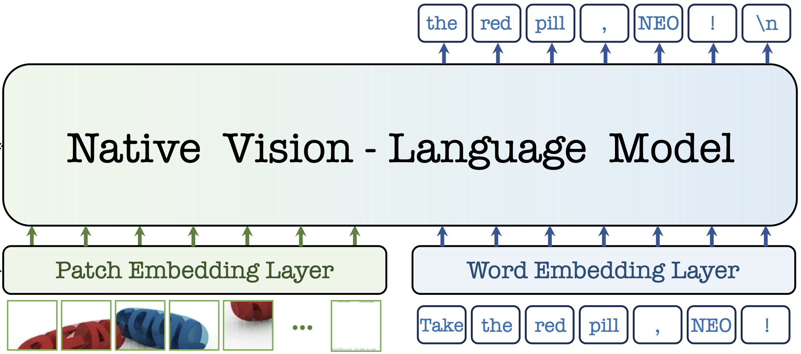
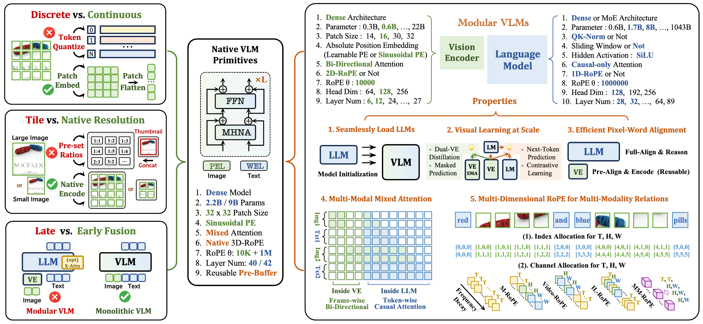

# <p align="center">  NEO Series: Native Vision-Language Models </p>

<p align="center">
  
</p>

- **2026/04**: [SenseNova-U1 with NEO-unify Architecture](https://arxiv.org/abs/2605.12500) (Technical Report 2026)

- **2026/02**: [NEO-unify: Building Native Multimodal Unified Models End to End](https://huggingface.co/blog/sensenova/neo-unify) (HuggingFace Blog 2026)

- **2025/12**: [From Pixels to Words -- Towards Native One-Vision Models at Scale](https://arxiv.org/abs/xxxx) (Arxiv 2026)

- **2025/09**: [From Pixels to Words -- Towards Native Vision-Language Primitives at Scale](https://arxiv.org/abs/2510.14979) (ICLR 2026)


## 📜 News   

[2026/05] 🔥 The [paper](https://xxxx), [weights](https://huggingface.co/collections/Paranioar/neo1-5), and [evaluation code](https://github.com/EvolvingLMMs-Lab/NEO/blob/main/VLMEvalKit_ov/README.md) of **NEO-ov** are released !    
[2025/12] 💥 **NEO-ov** has been completed !   
[2026/01] 🔥 The [training code](https://github.com/EvolvingLMMs-Lab/NEO/blob/main/VLMTrainKit/README.md) of NEO is released !        
[2025/10] 🔥 The [paper](https://arxiv.org/abs/2510.14979), [weights](https://huggingface.co/collections/Paranioar/neo1-0), and [evaluation code](https://github.com/EvolvingLMMs-Lab/NEO/blob/main/VLMEvalKit/README.md) of **NEO** are released !     
[2025/09] 💥 **NEO** has been completed !  


## 📋 Todo List

- [x] [Evaluation guide (NEO-ov)](VLMEvalKit_ov/README.md)
- [x] [Evaluation guide (NEO)](VLMEvalKit/README.md)
- [x] [Training guide](VLMTrainKit/README.md)


## 💡 Motivation

<p align="center">
  
</p>

- **What constraints set native VLMs apart from modular ones, and to what extent can they be overcome?**

- **How to make native VLMs more accessible and democratized, thereby accelerating their progress?**   

## 💡 Highlights

- 🔥 **Native Architecture:** NEO innovates a native VLM primitive  that unifies pixel-word encoding, alignment, and reasoning within a dense, monolithic model architecture. 

- 🔥 **Superior Efficiency:** With merely 390M image-text examples, NEO develops strong visual perception from scratch, rivaling top-tier modular VLMs and outperforming native ones.  

- 🔥 **Promising Roadmap:** NEO pioneers a promising route for scalable and powerful native VLMs, paired with diverse reusable components that foster a cost-effective and extensible ecosystem.


## ✒️ Citation 
If **NEO series** is helpful for your research, please consider **star** ⭐ and **citation** 📝 :

```bibtex
@article{Diao2025NEO,
  title        = {From Pixels to Words--Towards Native Vision-Language Primitives at Scale},
  author       = {Diao, Haiwen and Li, Mingxuan and Wu, Silei and Dai, Linjun and Wang, Xiaohua and Deng, Hanming and Lu, Lewei and Lin, Dahua and Liu, Ziwei},
  journal      = {arXiv preprint arXiv:2510.14979},
  year         = {2025}
}

@article{Diao2026NEOov,
  title        = {From Pixels to Words--Towards Native One-Vision Models at Scale},
  author       = {Diao, Haiwen and Wang, Jiahao and Wu, Penghao and Dong, Yuhao and Niu, Yuwei and Zhu, Yue and Cai, Zhongang and Fan, Weichen and Dai, Linjun and Wu, Silei and others},
  journal      = {arXiv preprint arXiv:xxxx},
  year         = {2026}
}

@misc{sensenova2026neounify,
  title        = {NEO-unify: Building Native Multimodal Unified Models End to End},
  author       = {SenseNova},
  journal      = {Hugging Face blog},
  url          = {https://huggingface.co/blog/sensenova/neo-unify},
  year         = {2026}
}

@article{sensenova2026sensenovau1,
  title        = {SenseNova-U1: Unifying Multimodal Understanding and Generation with NEO-unify Architecture},
  author       = {Diao, Haiwen and Wu, Penghao and Deng, Hanming and Wang, Jiahao and Bai, Shihao and Wu, Silei and Fan, Weichen and Ye, Wenjie and Tong, Wenwen and Fan, Xiangyu and others},
  journal      = {arXiv preprint arXiv:2605.12500},
  year         = {2026}
}
```

## 📄 License 
The content of this project itself is licensed under [LICENSE](https://github.com/EvolvingLMMs-Lab/NEO?tab=Apache-2.0-1-ov-file#readme).
